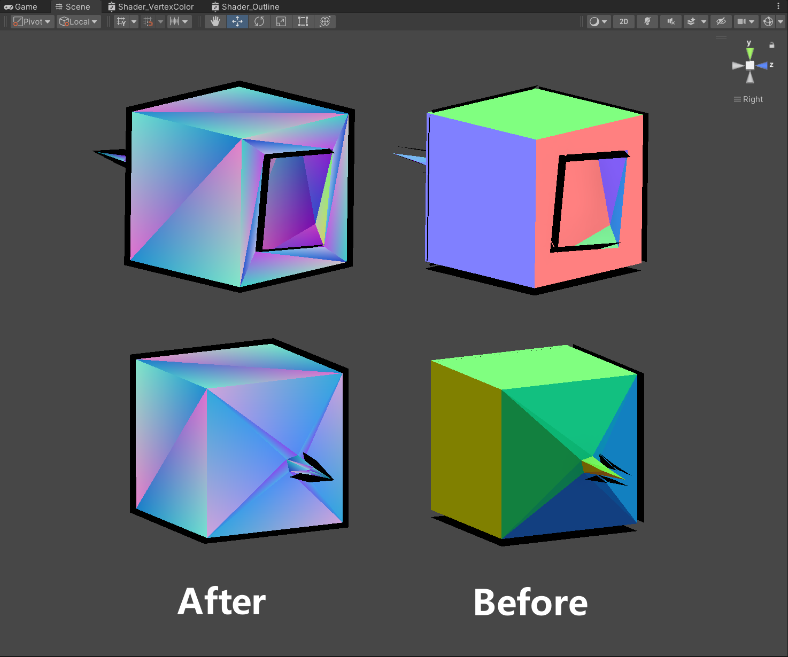
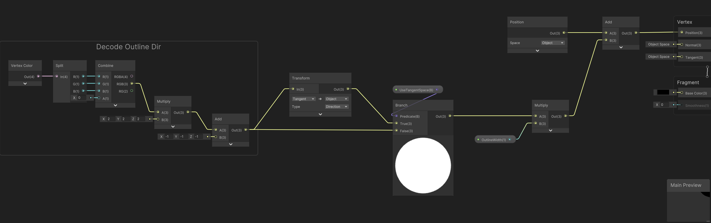

# Unity Outline Normal Smoother
本插件可以快速且自动地解决卡通描边在硬边处断裂的问题, 开箱即用, 可自定义, 高性能 (Jobs + Burst + Mathematics).

This plugin quickly and automatically solves the problem of Toon Outlines breaking at hard edges, out-of-the-box, customisable, high performance (Jobs + Burst + Mathematics).



## 安装 Installation

1. Make sure your Unity Version >= 2022.2
2. Open your project
3. `Window > Package Manager > Add > Add package from git URL` , enter: `https://github.com/JasonMa0012/OutlineNormalSmoother.git`
   - You can also choose to manually download the Zip from Github，then: `Package Manager > Add package from disk`

## 用法 Usage

1. 为你的模型文件名加上`_Outline`后缀, 例如`Cube_Outline.fbx`.
2. 将模型导入Unity, 此时会自动计算该模型的描边法线, 并存储在顶点色中.
3. 你可以在`Packages\OutlineNormalSmoother\Test\DemoScene.unity`场景中用你的模型替换Cube模型查看平滑后的描边结果.
4. 如果要在你自己的Shader使用描边法线, 请查看`Packages\OutlineNormalSmoother\Test\Shader_Outline`中的示例.

--------

1. Add the `_Outline` suffix to your model file name, e.g. `Cube_Outline.fbx`.
2. Import the model into Unity, where the outline normals for the model will be automatically calculated and stored in the vertex color.
3. You can replace the Cube model with your model in the `Packages\OutlineNormalSmoother\Test\DemoScene.unity` scene to see the smoothed outlines.
4. To use outline normals in your own Shader, see the example in `Packages\OutlineNormalSmoother\Test\Shader_Outline`.



## 自定义 Customize

### 自定义导入规则 Customize Import Rules

你可以复制并修改`Packages\OutlineNormalSmoother\Editor\SampleCustomImportRule.cs`以自定义导入规则, 筛选哪些模型需要烘焙描边法线, 示例代码如下.

You can copy and modify `Packages\OutlineNormalSmoother\Editor\SampleCustomImportRule.cs` to customize the import rule, filtering which models need to be baked with outline normals, as shown in the following example code.

```c#
internal static bool ShouldBakeOutlineNormal(string assetPath, [MaybeNull] AssetPostprocessor assetPostprocessor)
{
    bool shouldBakeOutlineNormal = false;
    
    // assetPostprocessor will be null when moving assets.
    var modelImporter = assetPostprocessor == null 
	    ? AssetImporter.GetAtPath(assetPath) as ModelImporter
	    : assetPostprocessor.assetImporter as ModelImporter; 

    // **_Outline.*
    shouldBakeOutlineNormal |= Path.GetFileNameWithoutExtension(assetPath).EndsWith("_Outline");

    // Assets\Test\**
    shouldBakeOutlineNormal |= OutlineNormalImporter.NormalizeDirectorySeparatorChar(assetPath).StartsWith(
	    OutlineNormalImporter.NormalizeDirectorySeparatorChar(@"Assets\Test\"));
    
    if (modelImporter != null)
    {
	    // importTangents == Import
	    shouldBakeOutlineNormal |= modelImporter.importTangents == ModelImporterTangents.Import;
    }

    return shouldBakeOutlineNormal;
}

[InitializeOnLoadMethod]
internal static void RegisterEvent()
{
    /* >>>>>>>>>>>>>>>>> Uncomment to register the event <<<<<<<<<<<<<<<<< */
    // OutlineNormalImporter.shouldBakeOutlineNormal = ShouldBakeOutlineNormal;
}

```


### 自定义数据存储 Custom Data Storage

你可以复制并修改`Packages\OutlineNormalSmoother\Editor\SampleCustomBaker.cs`以自定义数据存储位置, 示例代码如下.

You can copy and modify `Packages\OutlineNormalSmoother\Editor\SampleCustomBaker.cs` to customize the location of the data storage, as shown in the following example code.

```c#
internal static void SaveOutlineNormalToMesh(Mesh mesh, ref NativeArray<Color> bakedColors, ref NativeArray<Vector3> smoothedNormalTangentSpace)
{
    // Save to Vertex Color RGB (smoothedNormal * 0.5 + 0.5)
    // originalMesh.colors = bakedColors.ToArray();
    
    // Save to uv2
    var uvs = mesh.uv2;
    var smoothedNormalTS = smoothedNormalTangentSpace.ToArray();
    {
        for (int i = 0; i < mesh.vertexCount; i++)
        {
            uvs[i] = new Vector2(smoothedNormalTS[i].x, smoothedNormalTS[i].y);
        }
    }
    mesh.uv2 = uvs;
}

[InitializeOnLoadMethod]
internal static void RegisterEvent()
{
    /* >>>>>>>>>>>>>>>>> Uncomment to register the event <<<<<<<<<<<<<<<<< */
    // OutlineNormalBacker.onSaveToOriginalMesh = SaveOutlineNormalToMesh;
}

```


## FAQ

如果使用过程中仍然遇到描边问题, 请检查你的模型是否有非法数据, 比如:

- 缺失或非法 (0 / NaN) 的法线/切线
- 非法的拓扑
  - 同一个三角形的多个顶点重合
  - 面积为0的三角形
- 非法的UV
  - 同一个三角形的多个顶点UV重合


If you are still experiencing outline problems, please check your model for illegal data, e.g.

- Missing or illegal (0 / NaN) Normals/Tangents.
- Illegal topology
  - Multiple vertices of the same triangle coincide
  - Triangles with 0 area
- Illegal UV
  - Multiple vertices of the same triangle overlap UVs
